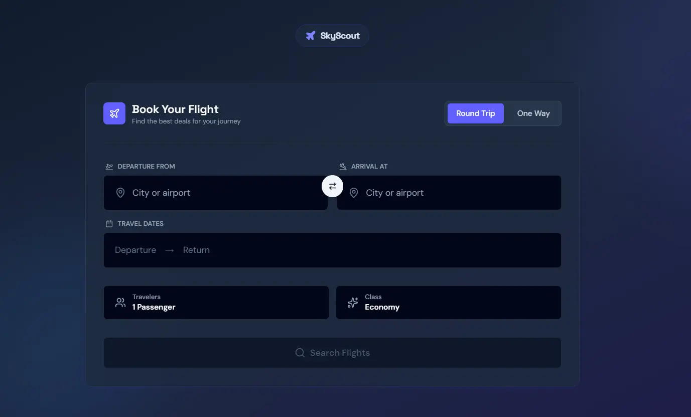

<div align="center">
  
  
  # ✈️ SkyScout - Flight Search Engine
  
  <p align="center">
    <strong>A modern, user-friendly flight booking platform</strong>
  </p>
  
  <p align="center">
    Find and compare the best flight deals from hundreds of airlines worldwide
  </p>
  
  <p align="center">
    Built with Next.js 16 • TypeScript • Tailwind CSS • Amadeus API
  </p>
  
  <p align="center">
    <a href="#features">Features</a> •
    <a href="#tech-stack">Tech Stack</a> •
    <a href="#getting-started">Getting Started</a> •
    <a href="#api-routes">API Routes</a>
  </p>
</div>

---

## ✨ Features

- 🔍 **Real-time Flight Search**: Search flights by origin, destination, dates, and passengers
- 🌍 **Smart Location Input**: Fast autocomplete with popular airports and instant search
- ✈️ **Live Flight Data**: Powered by Amadeus API for accurate, real-time flight information
- 🎯 **Instant Filtering**: Filter by price, stops, and airlines with immediate results
- 📊 **Interactive Price Charts**: Visualize price trends with responsive charts
- 🎨 **Modern UI**: Clean, shadcn-compliant design with smooth animations
- 📱 **Responsive Design**: Optimized for desktop, tablet, and mobile devices
- 🌙 **Dark Mode Support**: Seamless light and dark theme switching

## 🚀 Tech Stack

- **Framework**: Next.js 16.1.2 (App Router, Turbopack)
- **Language**: TypeScript
- **Styling**: Tailwind CSS with shadcn/ui components
- **State Management**: Zustand
- **API**: Amadeus Flight Search API
- **Data Visualization**: Recharts
- **Icons**: Lucide React
- **Date Handling**: date-fns
- **UI Components**: Base UI React

## 📁 Project Structure

```
├── app/                    # Next.js App Router
│   ├── api/               # API routes (flights, locations)
│   ├── search/            # Search results page
│   └── layout.tsx         # Root layout with SEO metadata
├── components/
│   ├── features/          # Feature components
│   │   ├── search/        # Search form and location inputs
│   │   └── results/       # Flight results, filters, charts
│   ├── ui/                # Reusable UI components (shadcn)
│   └── layout/            # Layout components
├── lib/
│   ├── api/               # API types and utilities
│   └── amadeus-client.ts  # Amadeus API client
├── store/                 # Zustand state management
└── public/                # Static assets (favicon, manifest)
```

## 🏁 Getting Started

### 📋 Prerequisites

- Node.js 18+ 
- npm, yarn, or pnpm
- Amadeus API credentials ([Get free test credentials](https://developers.amadeus.com/))

### 🔧 Installation

1.  **Clone the repository**:
    ```bash
    git clone https://github.com/yourusername/skyscout.git
    cd skyscout
    ```

2.  **Install dependencies**:
    ```bash
    npm install
    ```

3.  **Set up environment variables**:
    Create a `.env.local` file in the root directory:
    ```env
    AMADEUS_CLIENT_ID=your_client_id_here
    AMADEUS_CLIENT_SECRET=your_client_secret_here
    ```

4.  **Run the development server**:
    ```bash
    npm run dev
    ```

5.  **Open the app**:
    Visit [http://localhost:3000](http://localhost:3000)

### 🏗️ Build for Production

```bash
npm run build
npm start
```

## 🔌 API Routes

- `GET /api/locations?keyword={query}` - Search for airports and cities
- `GET /api/flights?origin={code}&destination={code}&date={date}` - Search for flights

## 🌐 Environment Variables

| Variable | Description | Required |
|----------|-------------|----------|
| `AMADEUS_CLIENT_ID` | Your Amadeus API Client ID | Yes |
| `AMADEUS_CLIENT_SECRET` | Your Amadeus API Client Secret | Yes |

## 🔍 SEO Features

- Comprehensive metadata with Open Graph and Twitter Card support
- Sitemap generation for search engines
- Robots.txt for crawler control
- Semantic HTML structure
- Progressive Web App (PWA) support via manifest.json

## 🔒 Security

- API credentials stored in environment variables (never committed)
- Server-side API calls only (credentials never exposed to client)
- Development-only error logging
- Sanitized error messages in production

## 🤝 Contributing

Contributions are welcome! Please feel free to submit a Pull Request.

## 📄 License

MIT

---

<div align="center">
  <p>Made with ❤️ by the SkyScout team</p>
  <p>
    <a href="https://github.com/yourusername/skyscout/issues">Report Bug</a> •
    <a href="https://github.com/yourusername/skyscout/issues">Request Feature</a>
  </p>
</div>
